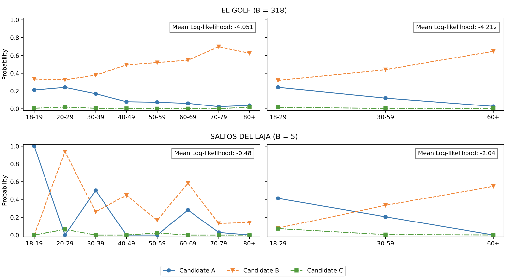
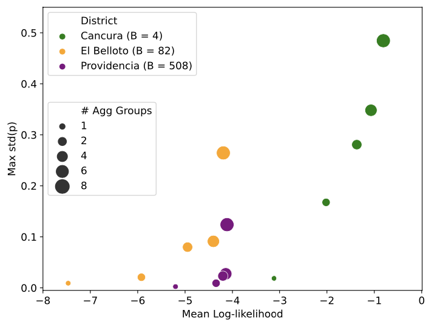

The following *vignette* will provide some useful information about a real use case of the library, occupiying the data from the Chilean Presidential Elections.

# Data loading

Let's note that the package already includes the dataset that we're interested in, hence, it'll only be neccesary to load it in. 

```{r}
library(fastei)

df <- get("chile_election_2021")
head(df)
```

Within the essence of working with elections data, it's important to reduce our observations within electoral districts. Hence, we'll define a function to filter by `ELECTORAL.DISTRICT` and return the results as an `eim` object

```{r}
# function that filters a specific electoral district from the Chilean election dataset
get_XW_Chile <- function(elect_district, merge_blank_null = TRUE, remove_mismatch = TRUE) {
    #  read dataset
    df <- get("chile_election_2021")
    # filter a specific electoral district
    df_ed <- df[df$ELECTORAL.DISTRICT == elect_district, ]
    # remove ballot boxes with mismatch of votes and voters
    if (remove_mismatch) {
        df_ed <- df_ed[df_ed$MISMATCH == FALSE, ]
    }
    # get columns of candidates' votes
    X <- df_ed[df_ed$ELECTORAL.DISTRICT == elect_district, c("C1", "C2", "C3", "C4", "C5", "C6", "C7", "BLANK.VOTES", "NULL.VOTES")]
    # merge blank and null votes
    if (merge_blank_null) {
        X$C8 <- X$BLANK.VOTES + X$NULL.VOTES
    }
    X <- X[, c("C1", "C2", "C3", "C4", "C5", "C6", "C7", "C8")]
    # convert X to matrix
    X <- as.matrix(X[, c("C1", "C2", "C3", "C4", "C5", "C6", "C7", "C8")])

    # get voters of ecah demographic group, and convert to matrix
    W <- as.matrix(df_ed[df_ed$ELECTORAL.DISTRICT == elect_district, c("X18.19", "X20.29", "X30.39", "X40.49", "X50.59", "X60.69", "X70.79", "X80.")])

    obj <- eim(X = X, W = W)
    return(obj)
}
```

For this case, it would be of our interest to work with the electoral district *"El Golf"*. Also, for allowing us to use mismatches, we will create two eim objects.

```{r}
obj <- get_XW_Chile("EL GOLF")
obj_m <- get_XW_Chile("EL GOLF", remove_mismatch = FALSE)

sprintf("The amount of mismatches is %d", nrow(obj_m$X) - nrow(obj$X))
```

# Setting the algorithm

Before running directly the algorithm there are some things that can be done. First of all, we would like to know what's the best group aggregation such that the log-likelihood is maximized. There's usually a reward for aggregating groups within big districts.



However, there's a trade-off between the log-likelihood and standard deviation.



Formally then, it would be of our best interest to find the best fit for creating macro-groups. We'll use a greedy approach `get_agg_opt` and a heuristic approach `get_agg_proxy`.

```{r}
obj <- get_agg_opt(obj, sd_threshold = 0.01, seed = 42)
obj2 <- get_agg_proxy(obj, sd_threshold = 0.01, feasible = FALSE, seed = 42)

obj$group_agg
obj2$group_agg
```

Note that the group aggregation has the same size, however, it had chosen different indices. We surely know that $[5, 8]$ is the optimal aggregation, however, $[3, 4]$ isn't that far from said values.
